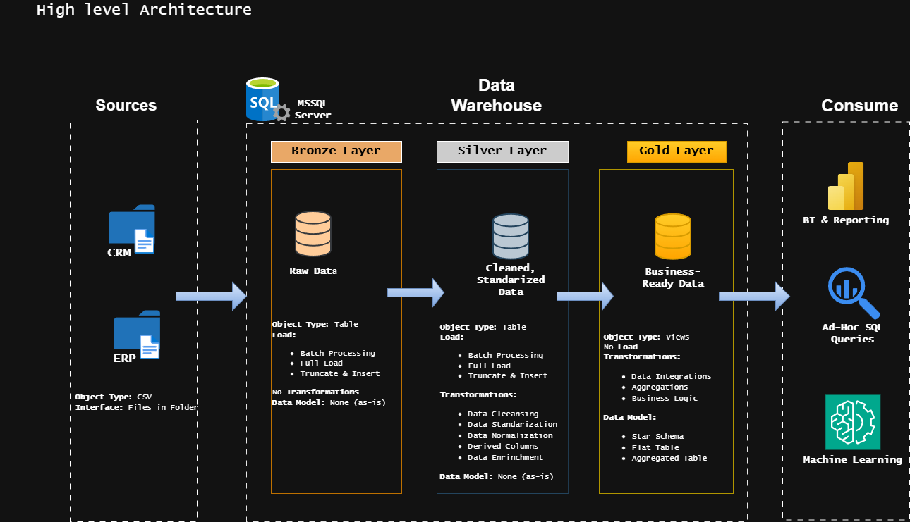

# SQL Data Warehouse Project

Welcome to the **SQL Data Warehouse Project** repository! 🚀  
This project demonstrates a modern **data warehouse and analytics workflow** using **Microsoft SQL Server** and the **Medallion Architecture (Bronze → Silver → Gold)**.

The goal of this project is to showcase **real-world data engineering practices**, including ETL pipelines, data modeling, and analytics-ready datasets.

---

# 🏗️ Data Architecture

This project follows the **Medallion Architecture** design pattern with three layers: **Bronze**, **Silver**, and **Gold**.

### Bronze Layer — Raw Data
- Stores data **exactly as received** from source systems
- Data is ingested from **CSV files into SQL Server**
- No transformations are applied

### Silver Layer — Cleaned & Standardized
- Data cleansing and validation
- Data standardization and normalization
- Derived columns and transformation logic

### Gold Layer — Business Ready
- Business-ready datasets
- Data integration and aggregations
- Star schema modeling for analytics and reporting

---

# 📖 Project Overview

This project covers the full lifecycle of a **modern analytics data warehouse**.

### 1. Data Architecture
Designing a scalable warehouse using the **Bronze, Silver, and Gold** architecture pattern.

### 2. ETL Pipelines
Building SQL-based pipelines to:
- Extract data from source systems
- Transform and clean data
- Load processed data into analytical models

### 3. Data Modeling
Designing **fact and dimension tables** optimized for analytics workloads.

### 4. Analytics & Reporting
Using SQL queries to generate insights related to:
- Customer behavior
- Product performance
- Sales trends

---

# 🛠 Tools & Technologies

The project uses commonly used tools in modern data engineering workflows.

- **SQL Server Express** – Database engine
- **SQL Server Management Studio (SSMS)** – Database management interface
- **Git & GitHub** – Version control and project collaboration
- **DrawIO** – Data architecture and modeling diagrams
- **CSV datasets** – Source data for ETL pipelines

---

# 🚀 Project Requirements

## Building the Data Warehouse

### Objective
Develop a **modern SQL Server data warehouse** to integrate multiple datasets and enable analytical reporting.

### Specifications

**Data Sources**
- ERP dataset (CSV)
- CRM dataset (CSV)

**Data Quality**
- Resolve missing values
- Standardize formats
- Remove duplicates

**Integration**
- Combine ERP and CRM data into a unified analytical model

**Scope**
- Focus on the latest dataset (no historical versioning required)

**Documentation**
- Provide architecture diagrams and data model documentation.

---

# 📊 Data Warehouse Layers

| Layer | Purpose | Example |
|-----|-----|-----|
| **Bronze** | Raw ingestion from sources | ERP / CRM CSV tables |
| **Silver** | Cleaned and standardized data | Validated customer/product tables |
| **Gold** | Business-ready analytical models | Sales fact table, dimension tables |

---

# 🎯 Skills Demonstrated

This project highlights key skills relevant for **Data Engineering and Analytics roles**:

- SQL Development
- Data Warehouse Architecture
- ETL Pipeline Design
- Data Modeling (Star Schema)
- Data Quality Validation
- Analytical SQL

---

# 📈 Potential Extensions

Possible future improvements include:

- Incremental ETL pipelines
- Slowly Changing Dimensions (SCD Type 2)
- Pipeline orchestration (Airflow)
- Automated data quality monitoring
- Dashboard development (Power BI / Tableau)

---

# 🛡 License

This project is licensed under the **MIT License**.  
Please take a look at the [LICENSE](LICENSE) file for more details.
